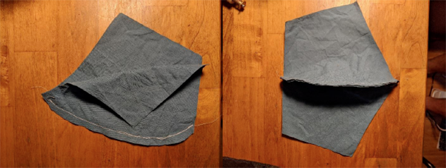
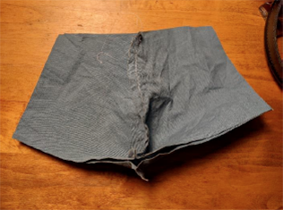
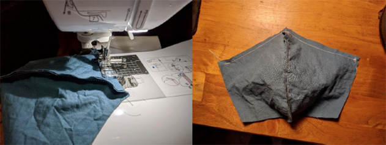
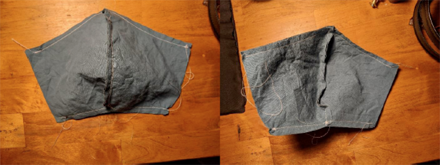
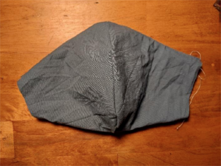
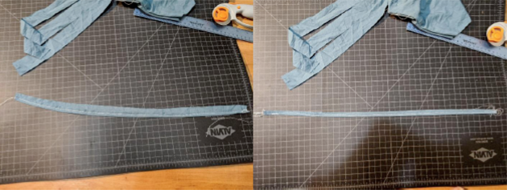
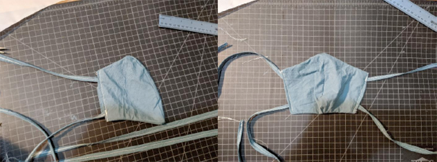

# Aloha Mask
Rev 1 | 3/25/20
Based on the Fu Face Mask: [https://freesewing.org/docs/patterns/flu](https://freesewing.org/docs/patterns/flu)

## Contents
1. Contents
2. Summary
3. What you need
4. Instructions
    4.1 Join center seam
    4.2 Sew the outer to the inner fabric
    4.3 Turn the mask inside-out
    4.4 Make the straps
    4.5 Attach the straps to the side of the mask and edge-stitch the opening
5. References

## 2 Summary

Healthcare professional rely on surgical and N95 masks as critical personal protective equipment (PPE) when treating patients who have contagious infections. Amidst the global COVID-19 pandemic, many health care facilities have identified shortages in their available supply of masks for their workers. This critical shortage puts healthcare workers at risk to contract an infection while treating the infected.

To address this issue, the Aloha Mask is a homemade mask solution when all other options are exhausted. Healthcare workers should always attempt to use the best available PPE when treating infected patients, but when no PPE exists something is better than nothing.

The Aloha Mask is made from an inner and outer layer of off-the-shelf cotton with the ability to insert extra filter material. Research suggests this arrangement offers some ability to screen sub-micron sized aerosols while maintaining suitable breathability for the wearer [1].

**The Aloha Mask is provided as-is with no quantified guarantee of protection from any pathogen. Users are encouraged to seek medical or construction grade masks as a primary option before resorting to using an Aloha Mask in a healthcare setting.**

[1]: Note this research has not been independently confirmed by the designers of the Aloha Mask.

## 3 What you need

To make an Aloha Face mask, you will need the following:
- Basic sewing supplies
- ALoha fu face mask kit

## 4 Instructions

### 4.1 Join center 

Note which side of the fabric is intended to be externally facing for the finished mask (i.e., the “good side”). Overlap two pieces of fabric such that the good sides are facing each other. Sew along the curved edge to form the center seam.

Repeat this step for both the outer fabric and the inner fabric.

### 4.2 Sew the outer to the inner fabric

Sew the inner (lining) fabric to the outer (main) fabric
- Place the lining fabric down with the good side up
- Place the main fabric on top with the good side down. You should now have both layers of your mask on top of each other with good sides facing together

- Sew the top and bottom seams, making sure to leave the sides open so we can turn the mask inside-out later.

## 4.3 Turn the mask inside-out

Turn the mask inside out such that the good sides are externally facing

## 4.4 Make the straps
To keep the straps from fraying fold and stitch the strap edges.

## 4.5 Attach the straps to the side of the mask and edge-stitch the opening
Attach four straps to the top and bottom corners of the mask (either to the inner liner or outer liner or both). The two straps attached to the bottom two corners should be roughly parallel with the bottom edge of the mask to allow for tying behind the head. The two straps attached to the upper two corners should be pointing up at roughly 45 degree angle from the bottom edge of the mask to allow for tying on top of the head.

Edge stitch the sides of the outer and inner linings to prevent fraying. Note that the sides are expected to remain open to allow additional filter material to be inserted in between the linings, as needed.

# 5 References
Davies, A. &.-A. (2013). [Testing the Efficacy of Homemade Masks: Would They Protect in an Influenza Pandemic? Disaster Medicien and Public Health Preparedness](https://www.cambridge.org/core/journals/disaster-medicine-and-public-health-preparedness/article/testing-the-efficacy-of-homemade-masks-would-they-protect-in-an-influenza-pandemic/0921A05A69A9419C862FA2F35F819D55/core-reader), 413-418.